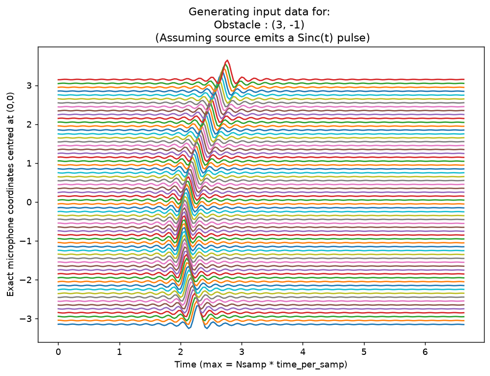
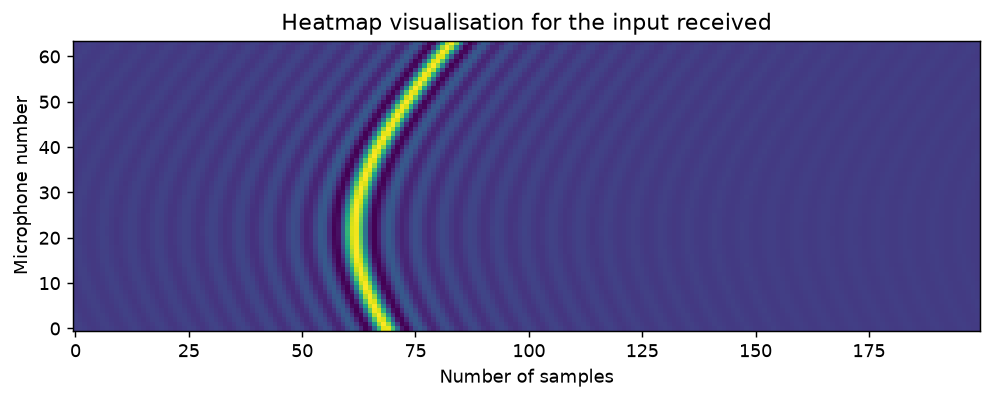
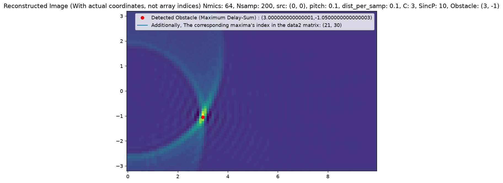
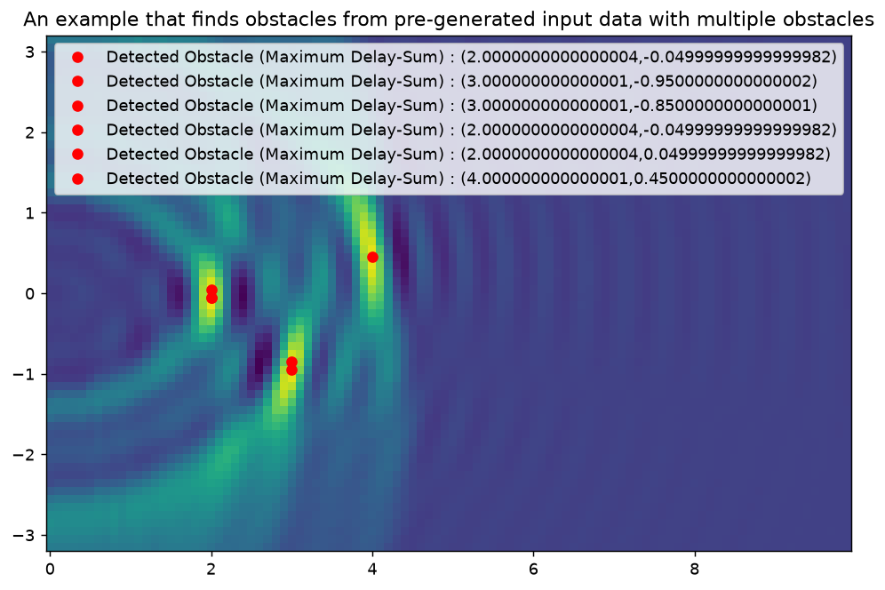

# Audio Heatmap Visualizer (Obstacle Detection)

Simulates a linear microphone array picking up an echo reflected off an obstacle, then reconstructs where the obstacle is using delay-and-sum (DAS) beamforming — the same underlying idea behind sonar, radar, and ultrasound B-mode imaging.

## Running

```bash
python "Obstacle Detection with Audio.py"
```

Requires `numpy` and `matplotlib`. It pops up 4 plots in sequence (each blocks until closed): the simulated per-microphone waveforms, a heatmap of that raw data, the reconstructed obstacle-location image for a single simulated obstacle, and a second reconstruction from an embedded real multi-obstacle dataset. Edit the `params = setup(...)` blocks to change the mic array size/spacing, source position, wave speed, or obstacle location.

## How it works

**Forward model (simulating what the mics hear):** A source at a fixed point emits a short pulse, modeled as `sinc(SincP * t)`. The pulse travels out, reflects off an obstacle at some point, and arrives at each microphone in a linear array. Each mic hears a delayed copy of the pulse, where the delay is the total path length `source → obstacle → mic` divided by the wave speed `C`. Since the mics sit in a line and the obstacle is off to one side, every mic is a slightly different distance from the obstacle, so each gets a slightly different delay. Plotting all mic signals stacked by position (`waveforms.png`) or as a mic-vs-sample heatmap (`raw_heatmap.png`) shows this directly: the echo traces a curved band across the array, since delay is a nonlinear (square-root) function of mic position.

**Inverse problem (delay-and-sum beamforming):** `find_obstacle()` reconstructs where the reflection came from without knowing the true obstacle position. For every candidate point on a 2D grid, it computes the round-trip delay that point *would have* produced for each mic, converts that to a sample index, and sums the recorded sample at that index across all mics. At the true obstacle location, every mic's predicted delay lines up with where its echo actually landed, so the summed samples add constructively — a bright value. At the wrong location, the predicted delays are off for most mics, so the values being summed come from essentially unrelated parts of each waveform and mostly cancel — a dim value. Doing this over the whole grid produces an image (`data2`) whose brightest point is the detected obstacle, marked with a red dot in `reconstructed_single.png`. This is delay-and-sum beamforming — the same principle behind phased-array radar/sonar and ultrasound imaging, here with a straight mic array instead of a curved probe.

**Reconstruction range:** the code only scans the X-axis up to `Nsamp/2`. At that distance, the round-trip path to the nearest mic is already close to `Nsamp * dist_per_samp` — the farthest distance the recorded data actually covers — so points further out wouldn't have any mic that captured the pulse's peak at all, and can't be localized. `Nmics` sets how wide a Y-range of obstacle positions the array can cover, and `Nsamp` sets how far out in X.

**Sharpness depends on pulse width:** a higher `SincP` (a narrower, more compressed sinc pulse) or a lower `C` (which, for fixed sample spacing, makes the same pulse span fewer sample indices) both make the delay-sum peak steeper and more localized — points near the true obstacle score much higher than points slightly off, so the reconstructed bright spot is tight and well-defined. A wider pulse (lower `SincP`, or higher `C`) means many nearby points all produce a similarly high delay-sum, so the reconstruction — visible as the smeared, bowtie-shaped region around the peak in `reconstructed_single.png` — gets more muddled.

**Multiple obstacles:** `find_obstacle(..., multiple_obstacles=True)` marks every point within a small threshold of the maximum instead of only the single brightest one, which is why `reconstructed_multi.png` (reconstructed from a real embedded multi-mic dataset) ends up with several obstacles located in one image.

## Screenshots

**Simulated per-mic waveforms** (source emits a sinc pulse, each mic sees a delayed copy):


**Same raw data as a mic-vs-sample heatmap** (the curved echo trace across mics):


**Delay-and-sum reconstruction, single simulated obstacle at (3, -1):**


**Delay-and-sum reconstruction from a real multi-obstacle dataset:**

